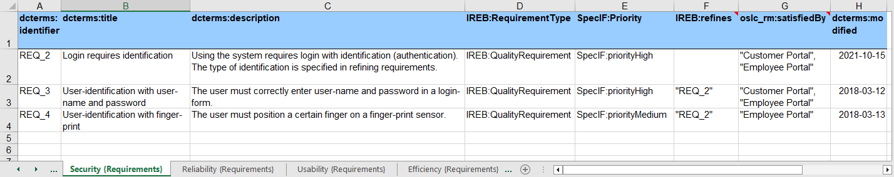

{: .highlight }
_Acknowledgement: Parts of the text have been translated with www.DeepL.com/Translator (free version)._

# Quick Start Guide

## SpecIF Goals

SpecIF stands for "Specification Integration Facility". Process and system descriptions from various sources are 
brought together in an open format and can be published independently of the authoring tools.

The initiators assume that
- there will always be different tools for the disciplines involved;
- It is not sensible to oblige everyone involved to use a certain tool;
- and that there is nevertheless a high level of interest in reading, searching through and checking 
the work results of all those involved in a common context.

The following use cases are considered:
<ol>
  <li>System engineering collaboration in the supply chain</li>
  <ul>
    <li>Automotive: „ReqIF for system models with linked requirements“</li>
    <li>Aerospace</li>
    <li>Utilities: Planning and maintaining renewable energy parks</li>
  </ul>
  <li>Model exchange between system modeling tools</li>
  <ul>
    <li>SysML: Enterprise Architect®, Cameo®, Rhapsody® and others</li>
    <li>Other notations</li>
  </ul>
  <li>Integration of models from different notations and tools</li>
  <ul>
    <li>Navigate, search and audit partial models in a common context</li>
  </ul>
</ol>

For this purpose, SpecIF offers a cross-method and cross-manufacturer solution. Existing formats and vocabularies are used as far as possible. 
The motivation of the GfSE working group PLM4MBSE is summarized in a position paper 
<a href="http://gfse.de/Dokumente_Mitglieder/ag_ergebnisse/PLM4MBSE/PLM4MBSE_Position_paper_V_1_1.pdf" target="_blank">10 Theses about MBSE and PLM</a>.

Further information can be found on the <a href="https://specif.de" target="_blank">SpecIF homepage</a>, 
including motivation, examples with online demos and conference papers.

## Setup

SpecIF data can be read with a web browser (preferably Firefox, Chrome or Edge) using the SpecIF viewer or SpecIF editor. 
In contrast to a document, models in SpecIF format can be easily checked because they do not only contain the model elements, 
but also their semantic relationships.

### Install the SpecIF Viewer/Editor

#### Install Viewer/Editor on a Web-Server

Download the last released program version “specIF-apps.vX.Y.zip” from <a href="https://github.com/GfSE/SpecIF-Viewer/releases" target="_blank">GfSE/SpecIF-Viewer/releases</a>, 
to be found in the collapsible “assets” section, and unzip the file in the file system of the web server of your choice. 
Enter "http://domain.tld/path/view.html" or "http://domain.tld/path/edit.html" in the address line of your web browser to start the respective app. 
Of course, "domain.tld/path" has to be replaced according to your installation.

#### Use the Installed SpecIF-Viewer/Editor

If the guidelines of your network permit, you can use the <a href="https://specif.de/apps/view.html" target="_blank">SpecIF Viewer</a> 
or the <a href="https://specif.de/apps/edit.html" target="_blank">SpecIF Model Integrator and Editor</a>, provided for demonstration purposes. 
You always benefit from the latest release.

### Prepare the Model-data

Currently the formats SpecIF, ReqIF, UML/SysML (Cameo), BPMN (BPMN-XML), ArchiMate (Open-Exchange XML) and MS Excel® (XLSX. XLS and CSV) are supported.

In case of SpecIF, ReqIF, BPMN and ArchiMate, no further preparations are required; files of this type can be imported directly.

In Excel® files, meaning can be assigned to resources, statements and their attributes by applying certain conventions; see Chap. 3.

### Import a Model

The start page of the viewer / editor lets you first select the data format and gives you some specific information. Any formats other than SpecIF are converted into the SpecIF format during import.

To import a file, after selecting the relevant type, click on ↗ `+ Select file` and the familiar file picker of your web browser will open; eligible files are filtered. Select the desired model file.

Then, click on an action button:
- ↗ `Create` loads the selected model.
- ↗ `Replace` discards previously loaded models and loads the selected one.
- ↗ `Adopt` adds the selected submodel to the already loaded one. In this case, resources that have already been imported adopt those of the new submodel if they have a compatible type and the same title; the identifier is ignored. This import mode is useful when partial models from different authoring tools are to be merged. For example, if a data object occurs in a BPMN process diagram and at the same time in an ArchiMate information model, then in the resulting semantic network the resource loaded first remains and all relations of the adopted resource are added.
It should be noted that all attribute values of the adopted resource are lost if the corresponding one of the adopting resource already has a value. In other words: An attribute value of the adopted resource is taken over only if the adopting resource has no corresponding value.
- ↗ `Update` also adds the selected submodel to the previously loaded ones. In this case, existing resources, such as diagrams or model elements with the same identifier, are updated if the creation date of the new resource to be imported is more recent. The same applies to all other elements such as relations, files and hierarchies. For data types and classes, a check is made beforehand to ensure that the consistency of the entire semantic network is maintained. For example, it is always possible to add another attribute to a resource class, but an attribute can only be removed if no instance of the class has a value for that attribute. 
The relationships of both the existing and new revisions of the model element are associated with the latter, the now current revision.

After successful loading, the view changes to "Read" resp. "Edit".

{: .highlight }
_Note: If you load data from your local file system, it will be processed locally by your web browser. The SpecIF viewer or editor does not send any user data over the Internet and does not save any user data on a server. All user data remain local in your workstation._

### Read a SpecIF Model

In the ↗ `Document` tab, the model is presented in a structure or outline chosen by the author.

You can open and close the structural levels on the left; the respective contents are shown on the right. 
In the main column, the properties designated as title, description and diagram are shown, plus any other properties in a narrow column on the right.

With certain SVG model diagrams, e.g. with FMC- or BPMN-notation created by <a href="http://arcway.com" target="_blank">ARCWAY Cockpit</a>, 
the diagram elements are linked to the corresponding data elements such that their title and description are displayed when the mouse is hovered over them. 
The element is jumped to with a double click. 
Here is a small <a href="https://specif.de/apps/edit#view=doc;node=N-Diagram-aec0df7900010000017001eaf53e8876;import=https://specif.de/examples/v1.1/09_Very-Simple-Model-FMC-with-Requirements.specifz" target="_blank">example</a>.

### Edit a Model Element

If permissions allow, a pen icon ↗ `🖉` is active at the selected model element in the upper right corner. Clicking opens an editing window whose fields are determined by the current element type. 
Entries are checked key by key for correctness: For example, a red frame immediately indicates when a letter is entered in a number field.

Fields of type text (data type xs:string) allow formatting by means of XHTML or <a href="https://www.markdownguide.org/cheat-sheet/" target="_blank">markdown</a>, 
which is interpreted accordingly during display or document generation.

By the way, texts can also be formatted using XHTML and markdown in many authoring tools, including Excel®, Archi, Camunda Modeler and Cameo. The formatting is preserved during import.

### Investigate Semantic Relationships

In the ↗ `Relations` tab, the semantic relationships of the element selected in the outline to the left are shown. 
Most relationships are automatically created by graphically analyzing the model diagrams, 
such as “component XY contains function FR” when the block representing function FR is spatially contained in the block representing component XY. 
Some relationships have to be created manually as part of the analysis and system design, for example "Component XZ satisfies requirement 134".

The selected element is a little darker and shown in the center of the spider. This example expresses the following dependencies:
- the "Mail Room" is shown on 4 diagrams,
- it is included in the organization "Postal Department",
- is mentioned by another element „Application Landscape“ in the text,
- itself contains several elements (please double-click the diamond so that the individual elements are shown),
- reads a document „Invoice“,
- writes a document „Invoice Document“ and finally
- sends messages to an organization „Invoice Management“.

The relationships shown are the entirety of all statements relating to the selected element in the present model. 
For example, if one diagram shows that component A is contained in component B and another diagram shows the opposite situation, then it is clearly a contradiction. 
While it is hardly possible to look through the entire model with all its diagrams and check for consistency, 
such contradictions are quite easily uncovered when inspecting the statements of individual elements. 
Current work deals with automatic model testing using hard and empirical rules in order to improve model quality in the long term.

In this view, you can also double-click any element and navigate through the semantic network using the relationships.

### Create or Delete a Relation

Likewise on tab ↗ `Relations`, two buttons for creating and deleting relations become active, if permissions are granted. 

To create a relation ↗ `＋`, a dialog box is displayed, in which a valid relation type for the given model element and a suitable target element as subject or object can be selected. 
Only those options are offered that correspond to the ontology, so that only meaningful semantic relations are created.

To delete a relation ↗ `❌`, all relation targets of the selected model element are colored red. Double-clicking on a target element deletes the respective relation.

### Export a Model

Once the document has the desired structure and content, it can be saved in various formats by pressing ↗ `Export` at the top right:
- ↗ `SpecIF` creates a ZIP file with the semantic network in SpecIF format and all referenced images and files. It can be easily read back into the SpecIF editor at a later time.
- ↗ `HTML` with embedded SpecIF generates a file to be displayed in the web browser. All views and semantic relationships can be easily tracked and reviewed. 
The file contains Javascript and therefore some environments prohibit execution.
- ↗ `ReqIF` generates an XML file according to the OMG Requirement Interchange Format, which can be read by several Requirement Management (RM) and Application Lifecycle Management (ALM) tools.
- ↗ `Turtle` creates a file for reading into graph databases; it is a compact representation of the Resource Description Framework (RDF).
- ↗ `Epub` generates a file for electronic document readers.
- ↗ `MS Word®` creates an OOXML file that can be read and further edited using MS Word. Edited files are best saved in the compressed format DOCX. 
As is well known, Word files in change mode are a popular means of collaboration and adding content within a team.

## Special Authoring Tools

The term authoring tool is used here to describe software that is used to create partial models or compile other information related to a target system to be designed and specified.

### Microsoft Excel®

#### Folder

When importing Excel® files, a folder with the file name as title is created in the hierarchy of the SpecIF data-set. For each worksheet a subfolder is created with its name as a title. 

#### Resources

If there is a term in curly brackets in the name of a worksheet, it is used as the title of the resource class (SpecIF resourceClass, type of all resources/objects found on this worksheet). 
If the worksheet name does not contain a term in curly brackets, a term in curly brackets in the file name is used as a substitute. 
If no type designation is found there either, a generic title without a particular meaning is used for the resource class of the worksheet.

Unfortunately, no vocabulary term ready to be interpreted by the system can be used in the filename, as certain characters (e.g. the colon) may not appear in filenames. 
However, the terms “requirement”, “feature”, “annotation”, “user-story” and “pain-point“ are interpreted correctly by the viewer or editor and replaced by a vocabulary term.

For example, if an Excel file has the file name "Project-name (Requirement).xslx" and it contains two worksheets with the names "Functions (User Story)" and "Constraints", 
a resource-class with the title "User-Story" replaced by "SpecIF:UserStory" for the first worksheet and a resource-class with the title "Requirement" replaced by "IREB:Requirement" 
for the second worksheet are created.

#### Properties

Now for the contents of each worksheet. The property names (SpecIF property titles) are expected in the first table line of each worksheet and the resources ("instances") 
follow from the second line. Defined vocabulary terms are best used as attribute names, e.g. dcterms:title and dcterms:description from 
the <a href="https://www.dublincore.org/" target="_blank">Dublin Core Metadata Initiative</a>. 
The use of agreed terms conveys the meaning of the respective attributes so that, just one of the potential benefits, the user interface knows how to display the properties. 
For example, the title (denoted by dcterms:title) comes first in larger letters, underneath the description (denoted by dcterms:description) in the main column plus the 
remaining attributes in a narrower column on the right. However, there are many more benefits in the entire product development.

By the way, formatting in text fields using <a href="https://www.markdownguide.org/cheat-sheet/" target="_blank">markdown</a> is preserved during import so that, 
for example, text passages can be highlighted in bold or key points can be enumerated in a bullet list.

#### Enumerated Values

To define an attribute with enumerated values, a worksheet with name _{Enumerations}_ including the curly brackets is created. 
Here all values of a certain attribute are specified column by column. 
Again, the first line specifies the attribute name and the values below that are taken over up to the next blank line. 
In worksheets with user data, these values are provided for attributes with the same name; in the example given to the left, 
these are the attributes named _IREB:RequirementType_ and _SpecIF:Priority_. 
While Excel® also allows the specification of deviating values, this is not possible in case of SpecIF, therefore all values 
that do not correspond to those in the worksheet _(Enumerations)_ are ignored during import.

{: .highlight }
_Note: Excel® assists the user in entering values through a selection box when the values listed in the "(Enumerations)" 
worksheet are selected for the column in question using the menu Data > Data Tools > Data Validation._

This <a href="https://specif.de/examples/Example%20Telephone-Connection-Request%20(Requirements).xlsx" target="_blank">example</a> 
shows the described conventions. Here vocabulary terms have also been chosen for the enumerated attribute values. 
These are replaced in SpecIF Editor/Viewer by terms of the active national language, 
for example _SpecIF:priorityHigh_ is displayed as _hoch_ if German is selected in the browser. 
Of course, any terms can be used in the Excel worksheet, which will then be used directly in 
SpecIF Editor/Viewer regardless of the active browser language (without a defined meaning).

#### Relations

The same goes for the names of relationships (SpecIF statements); for example _oslc_rm:refinedBy_ between two requirements 
or _oslc_rm:satisfies_ between a system component and a requirement. In order to successfully create relationships, 
the user-defined IDs (_dcterms:identifier_) or titles (_dcterms:title_) of the respective elements must be given 
between double or single quotation marks. Multiple resources can be specified separated by commas. 
See columns _IREB: refines_ and _oslc_rm:satisfiedBy_ in the following figure.

By the way, the target of a relation like "DMS" in the figure does not have to be found in the same file. 
The relation is also established to a resource that originates from a different source, as long as the title resp. ID are identical.

Suitable terms are defined in the <a href="https://specif.de/apps/view.html#import=https://specif.de/v1.1/Ontology.specif" target="_blank">SpecIF Ontology</a>, 
namely for <a href="https://specif.de/apps/view.html#view=doc;project=P-SpecIF-Ontology;node=N-33z8X0jqbMdrd8PJDKyt2ke4yAB;import=https://specif.de/v1.1/Ontology.specif" target="_blank">property names (propertyClasses)</a>, <a href="https://specif.de/apps/view.html#view=doc;project=P-SpecIF-Ontology;node=N-GXf6xVO7XO5ciMypRwD5WDR6DHR;import=https://specif.de/v1.1/Ontology.specif" target="_blank">property values (propertyValues)</a> and for <a href="https://specif.de/apps/view.html#view=doc;project=P-SpecIF-Ontology;node=N-blM4lfyHM55YlbfBZ3NWj4SYwa3;import=https://specif.de/v1.1/Ontology.specif" target="_blank">statement names (statementClasses)</a>.

### Archi

Archi is a freely available modeling tool that supports the ArchiMate 3.0 notation of the Open Group. It can be obtained from <a href="https://www.archimatetool.com/download/" target="_blank">https://www.archimatetool.com/download/</a>.

A model created with Archi can be transformed into the SpecIF format or integrated with models from other sources as follows:
1. In the Archi tool, export all diagrams individually as an image in PNG or SVG format. To do this, right-click on a diagram to open the context menu and select ↗ `Export`, ↗ `View As Image`, then select the destination folder in the dialog and press ↗ `Save`.
2. Export the model in the "Open Exchange" format by selecting ↗ `File`, ↗ `Export` and ↗ `Export Model To Open Exchange File` from the main menu while the model is selected; then select the destination folder in the dialog and press ↗ `Save`. 
3. Now switch to the web browser and select or load the SpecIF editor as described in the previous chapter. First select the ↗ `ArchiMate` format in the top button bar. Using ↗ `+` Select file, choose the previously exported model in the Open Exchange format, which usually has the file extension '.xml'. The permitted action buttons ↗ `Create`, ↗ `Replace`, ↗ `Update` and ↗ `Adopt` are activated (see Chapter 2).
4. After the import is completed, the display automatically jumps to the ↗ Edit page in the ↗ `Document` tab. The sub-views and functions described in the previous chapter can be selected.
5. All entries in the outline that are not required can be deleted by clicking the delete icon ↗ `❌` on the right side of the screen.
6. The entries in the outline can also be moved using drag'n'drop.
7. Now select all the diagrams in the outline one after the other. The texts have been taken over, but the images have to be added manually. To do this, click the pencil icon ↗ `🖉` on the right edge of the screen when the diagram is selected. A modal dialog window opens with all the attributes of the element. For the ↗ `Diagram` attribute, click the pencil icon ↗ `🖉` again to open the file selection dialog and select the respective image file; the usual web formats SVG, PNG and JPG are supported. Finally, click ↗ `Update` at the bottom of the modal editing dialog. The document view now shows the model diagram in the main column.

Also for Archi, formatting in diagram or element descriptions using <a href="https://www.markdownguide.org/cheat-sheet/" target="_blank">markdown</a> is preserved during import so that, for example, text passages can be highlighted in italics or key points can be enumerated in a bullet list.

### ADOIT

ADOIT is a modeling tool licensed from the BOC Group, which supports the ArchiMate 3.0 notation of the Open Group. It can be obtained from <a href="https://www.boc-group.com" target="_blank">https://www.boc-group.com</a>.

A model created with ADOIT can be transformed into SpecIF format or integrated with models from other sources as follows:
1. In the ADOIT tool, export all desired diagrams individually as an image in PNG or SVG format. To do this, open a diagram by double-clicking in the model structure on the left and then save it in the menu bar directly above the diagram by ↗ `Export` and selecting the desired format. The file will be saved according to the settings of the browser; often in the folder "Downloads".
2. In the model structure, select all diagrams to be considered. Via context menu follow ↗ `Import/Export`, ↗ `ArchiMate exchange` and ↗ `Export`. A dialog window opens, in which the diagram selection is checked/changed if necessary and a name for project and file is assigned.
3. From the third step on, the procedure is the same as described above for Archi.

Also for ADOIT, formatting in diagram or element descriptions using <a href="https://www.markdownguide.org/cheat-sheet/" target="_blank">markdown</a> is preserved during import so that, for example, text passages can be highlighted in bold or key points can be enumerated in a bullet list.

### Cameo

Cameo Systems Modeler is a commercial modeling tool licensed by <a href="https://www.3ds.com/" target="_blank">Dassault Systèmes</a> supporting the UML and SysML notation of the OMG. 
It can be obtained from <a href="https://www.3ds.com/products/catia/no-magic/cameo-systems-modeler" target="_blank">https://www.3ds.com/products/catia/no-magic/cameo-systems-modeler</a>.

{: .highlight }
_Note: The transformation of UML/SysML models authored with Cameo to SpecIF is in development. 
Currently the UML Class Diagram, SysML Block Diagram (bdd) and Internal Block Diagram (ibd) are transformed._

A model created with Cameo can be transformed into SpecIF format or integrated with models from other sources as follows:
1. In the Cameo tool, export all desired diagrams individually as an image in PNG or SVG format. To do this, 
open a diagram by double-clicking in the model structure on the left and then save it via main menu ↗ `File` > `Save as Image`; select the desired file path and format. 
2. Save the model via main menu ↗ `File` > `Save Project` to obtain a *.mdzip file, which is accepted for import by the SpecIF Viewer and Editor.
3. From the third step on, the procedure is the same as described above for Archi; however choose the format `UML/SysML`.

Also for Cameo, formatting in diagram or element descriptions using <a href="https://www.markdownguide.org/cheat-sheet/" target="_blank">markdown</a> is preserved during import so that, 
for example, text passages can be highlighted in bold or key points can be enumerated in a bullet list. 
It is recommended to use markdown instead of the HTML feature offered by the input field _documentation_ available for most model elements.

## Terms of Use

### License

Both SpecIF as a format with schema and consistency checker as well as the SpecIF viewer/editor are open source and are subject to 
the <a href="https://github.com/GfSE/SpecIF/blob/master/LICENSE" target="_blank">Apache 2.0 license</a>, 
which also allows free use for commercial applications. If used in your own product, the source must be given.

### No Guarantee and No Liability

SpecIF and the SpecIF viewer are provided "as-is" and without guaranteed characteristics. 
Use is always at your own risk. Any liability and guarantee are excluded. 
The installation at <a href="http://specif.de/apps/" target="_blank">http://specif.de/apps/</a> and the code maintained 
at <a href="https://github.com/GfSE" target="_blank">https://github.com/GfSE</a> is a reference implementation and not designed for high loads and high availability.

<!-- link template  -->
