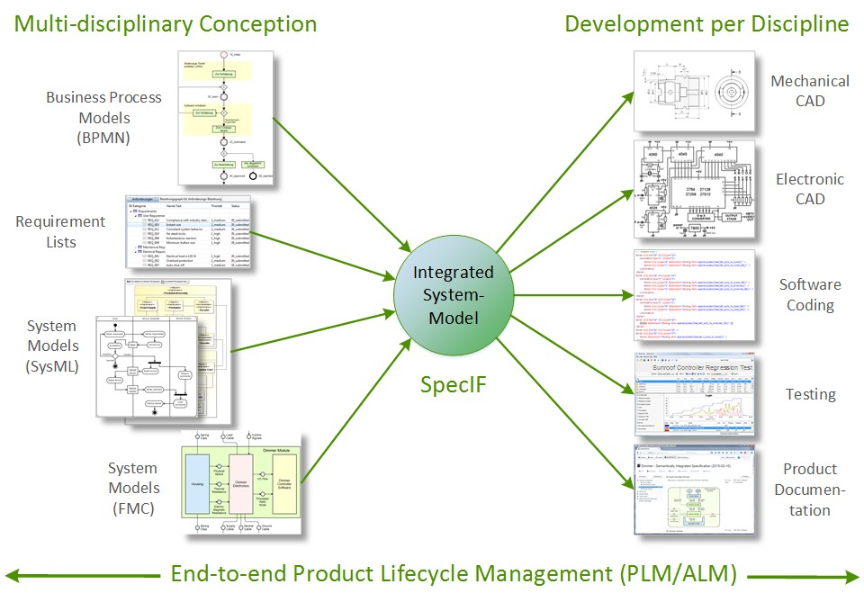
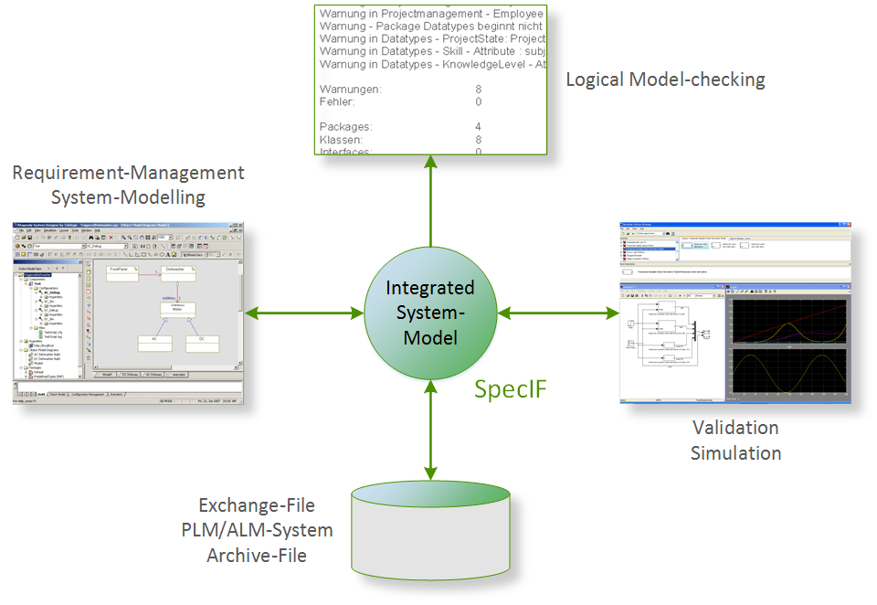
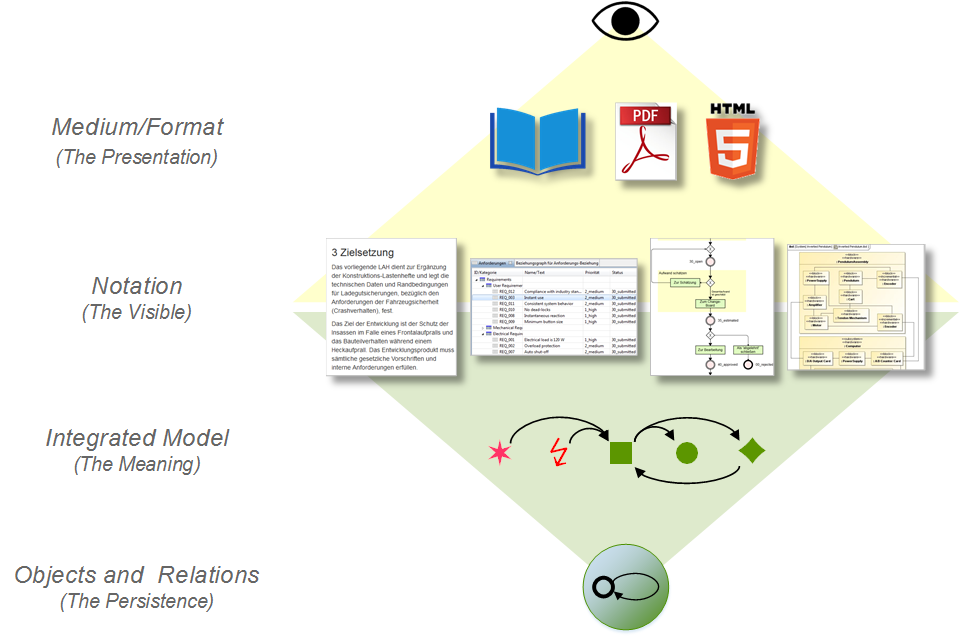
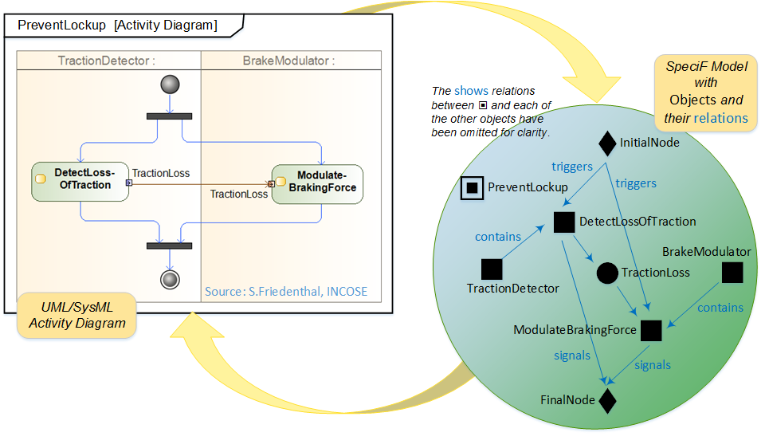

<!-- templates   -->

## News: GfSE releases SpecIF v1.1

On it's conference Tag des Systems Engineering (TdSE) 2021 the Gesellschaft für Systems Engineering (GfSE), German chapter of INCOSE, has released SpecIF v1.1. A <a href="https://specif.de/files/SpecIF/documents/2021-11%20GfSE-Announcement%20SpecIF%20v1.1.pdf" target="_blank">press statement</a> highlights the importance for collaboration in system design. Like all other results of the working group, the <a href="https://gfse.github.io/SpecIF-Pages/Documentation/" target="_blank">documentation</a> has been openly published on Github.

# Motivation

In the field of Systems Engineering (SE) a multitude of methods is being used with benefit every day; for example requirements mana­gement, modelling of system structure and behavior with UML/SysML or simulation with Modelica and other languages. There is infor­mation from various sources and in different formats, all providing valuable input for system design and development [3].

In practice, it is difficult or even impossible with acceptable effort to join the information and to put it in relation. Information from diffe­rent sources ("silos") is often inconsistent, because it is main­tained by different organi­zations with their own background and purpose. Popular modelling standards such as UML/SysML are notations, but leave semantic inter­pretation to tool-makers or users. For data (model) exchange there are several standards with respect to syntax, but very few which address the semantics as well.

The Specification Integration Facility (SpecIF) shall support the change from document-centric to artefact-centric colla­boration, which is a generally accepted goal in the domains of systems engineering and product lifecycle management (PLM). SpecIF defines a language for describing system models with attention to both syntax and semantics. By creating a common context for graphical and textual content, an understanding (beyond mere communi­cation) is achieved on a logical level. Existing technical formats and protocols such as ReqIF or RDF are adopted to take advantage of existing IT infra­structure.

# Goals

SpecIF contributes to the following objectives:
- **Lifecycle-Management from the Beginning:** Structures and content from the early phases of system conception are seam­lessly made available for development.
- **Embracing disciplines:** SpecIF creates a common context for models from disciplines such as Mechanics, Electronics, Software, Safety and others.
- **Embracing methods:** Texts as well as structural and behavioral models of popular methods, among others BPMN, SysML and FMC can be integrated. This means that individual elements ("resources") exist once and may appear on several model diagrams.
- **Technology-neutral:** SpecIF data can be transformed to various technical formats, such as relational datenbase, ReqIF, OSLC, XMI, graph-database or web linked-data (RDF).
- **Vendor-neutral and independent:** SpecIF is not limited to certain tools or vendors; in contrast, SpecIF lets you exchange model data between different tools and organizations.
- **Schema-compliant:** SpecIF data can be checked formally using a JSON- or XML-schema; the former has been made available at <a href="https://github.com/GfSE/SpecIF-Schema/tree/main/schema" target="_blank">SpecIF-Schema</a>.
- **Standard-compliant:** SpecIF draws on existing standards, most importantly from W3C, OMG and OASIS.
- **Open and cooperative:** 
All results are published with <a href="https://creativecommons.org/licenses/by-sa/4.0/" target="_blank">Creative Commons 4.0 CC BY-SA</a> license; allowing commercial use. The results can be further developed, but the origin must be stated and they must be published under similar terms; please consult the referenced license text. We encou­rage everyone interested to join our GfSE working group and to directly contribute to the results.

# Use Cases

Today, there is close cooperation between product OEMs, engineering service providers and suppliers. The business processes demand easy information exchange between all participating organizations:

- Exchange requirement-specifications and model-based system-specifications along the supply-chain.
- Publish results (including system models) from different authoring systems, usually requiring a high level of expertise, to a far bigger group of 'occasional' users for inquiry, commenting or auditing. Uniform access regardless of the authoring system is best practice.
- Show changes made over time and support the change management across organisations.

With respect to the content, information comes from different organisations and address product strategy and resulting requirements, laws and consumer protection, optimized user interaction, functions, system structure and behavior or even the validation of rqatings by means of simulation. The following tasks shall be supported:

- Integrate information and models from different sources and in different formats,
- Search and navigate consistently,
- Find and consolidate identical elements in different models,
- Detect and store dependencies and logical relations between model elements, essentially that is interrelating model elements with a semantic net,
- Detect errors, inconsistencies or violations of design rules,
- Reference ('trace') artefacts in subsequent development steps without copying.

# Method

## Levels of Information Representation

The goal is to combine information from various sources provided in different notations. Not only the visible is to be taken into account, but also the meaning. SpecIF brings the information in a common logical context and stores it using well known technologies.

Four abstraction levels are used:

- The format or medium carries the information to the reader, for example a booklet, a PDF-docu­ment for presentation with a specific software application or as HTML5-document for display in a web-browser.
- The notation defines how information is represented, that is how it looks like. The examples shown are text divided in titles and paragraphs, structured data in a table, BPMN process diagram and SysML block diagram.
- The integrated model holds the semantics, the meaning of the combined information, independently of their respective notation. It lends itself for analysis by machine, overall search as well as navigation.
- The entities and relations on the lowest level store the information, where many known technologies may apply.

## Fundamental Resource Types

A logical integration of model information prepared using different notations is made possible by abstraction of model elements to very few fundamental element types. Based on scientific research and practical experience, five model element types are proposed [9]:

- An ■ Actor represents an active entity, be it an activity, a process step, a function, a system component or a role.
- A ● State stands for a passive entity, be it a value, a document, an information storage or even a physical shape.
- An ♦ Event constitutes a time reference, a change in condition/value or more generally a synchronisation primitive.
- A ↯ Requirement is a singular documented physical and functional need that a particular design, product or process must be able to perform.
- A ✶ Feature is an intentional distinguishing characteristic of a system, often a unique selling proposition.

The Fundamental Modelling Concepts (FMC) conceived by Prof. Dr. Siegfried Wendt, founding director of the Hasso-Plattner-Institute Potsdam, and his research team show, that all models of known methods can be constructed using three model element types Actor, State and Event [1,2]. Requirement and Feature have been added for textual information complementing the models.

## Syntax

Within the SpecIF schema, the information model (meta-model) specifies the resource classes and statement classes that will be available for the system model.

- Resource-classes such as 'Requirement' oder 'System component',
- Statement-classes such as 'contains' or 'satisfies', where the permissible Resource-types for subjects and objects of any statement instance can be specified for convenience.
- Hierarchy-classes such as 'Document outline' or 'Bill of Materials', providing a linear and hierarchical view on the model elements.

All Classes may have an individual set of Property-classes with permissible value range each. For example, a 'Requirement' may have the properties 'Title', 'Description' and 'Priority'.

The resources, relations and hierarchies with their properties are instances of the respective classes. A SpecIF data-set contains both the classes and instances, so that not only the values, but also their classes with value ranges are known by all consumers.

## Semantics

### Ontology

Good understanding is based on a clear vocabulary or ontology for the respective domain. This is true both for communication involving people as well as systems.

For example, ReqIF is a format for information exchange standardized by the OMG [5], but is effectively used when applying the naming convention for the information elements which have been introduced by the ReqIF Implementor Forum of the ProSTEP iViP e.V.. Similar conventions have been published by the OSLC initiative. Interestingly, in both cases there are only names for the attributes, but not for the resources themselves: For example, the property carrying a descriptive text is named ReqIF.Text resp. dcterms:description, but there is no name for the requirement as a whole, such as ReqIF.Requirement oder oslc_rm:requirement (or whatever term may have been chosen).

SpecIF proposes an <a href="https://apps.specif.de/view.html#import=%22https://specif.de/v1.1/Ontology.specif%22" target="_blank">ontology</a> comprising names for resources and statements, as well as their properties and values. The conventions or definitions of Dublin Core, OSLC, IREB and other open standards are re-used whenever possible. The ontology itself is available in SpecIF-Format.

### Logical Statements

Relations between information elements express further meaning; they correspond to statements or assertions like 'Subject Predicate Object', where subject and object are information elements or 'resources'. Some statements have to be made manually by the analyst or system designer/architect, for example 'Component-XY satisfies Requirement-4711'. Most relations, however, can be derived automatically from the model diagrams, usually from the vertices between nodes.

By expressing the meaning depicted by model diagrams with explicit statements, navigation as well as automated graph-search and consistency checks are made possible:

- It is easy to query using dependencies, such as: 'Which parts are affected, if Requirement-123 is changed?' or 'Which components may write to database-AB?'. The meaning of the model is unlocked for machine evaluation.
- If one diagram shows that Component-N contains Component-M and another diagram shows the opposite, and if the relations are available explicitly and not only by a line on a diagram, it is easy to detect the inconsistency.

Essentially the SpecIF Integration-model consists of model-elements (resources with their properties) and logic statements using them. It is a semantic net which can be mapped to many technical formats, be it graph- or relational databases, JSON-files, linked-data for the world-wide-web and others.

## Principles of Model-Integration

The following five principles of semantic integration have been developed in various projects [7,8]:

- Separation of presentation and model: Hierarchical outlines, lists, texts and diagrams are all views of a common model.
- Abstraction of model elements: The common model consists of elements of the fundamental element types Actor, State and Event, complemented by Feature and Requirement. Specific models are transformed to the SpecIF Integrated Model according to the fundamental characteristic of their elements. The Integrated Model creates a common context for all.
- Consolidation: Identical model elements on multiple diagrams (with the same or different notations) represent the same element in the Integrated Model.
- Semantic interrelation: Logical dependencies between model elements are stored with explicit relations, which can be derived automatically or by a user.
- Ontology: A common terminology (glossary or ontology) simplifies the data exchange between systems, because entities and attributes can be collated automatically according to the respective data models. Also the understanding between project partners is improved, as terms with agreed-upon meaning are employed.

### Schema

For system specifications represented by SpecIF data in JSON format a <a href="https://github.com/GfSE/SpecIF-Schema/tree/main/schema" target="_blank">schema</a> is being developed publicly on Github. Furthermore, implementations of a schema-check and a constraint-check have been made available.

CORS-enabled hosting:
- SpecIF Home: <a href="https://specif.de/v1.1/schema.json" target="_blank">SpecIF v1.1 schema</a> and <a href="https://specif.de/v1.1/CCheck.mjs" target="_blank">constraints</a>
- Schemastore.org: <a href="https://json.schemastore.org/specif-1.1.json" target="_blank">SpecIF v1.1 schema</a>

Applications and suggestions are welcome!

# Examples

Two examples belonging to the application domains mechatronic systems and enterprise IT are described in [11], chapter 5. It is shown how process-models, system-structures and requirements are interrelated and which are the practical benefits.

The examples are stored in a data set following the current version of SpecIF. Technically speaking you find ZIP-files containing the model-information in JSON format plus the images referenced by the model. A hierarchical document outline lets you comfortably read the content, whereas the relations let you browse the semantic net.

- Semantically integrated system model of a dimmer: <a href="./examples/Dimmer.specifz" target="_blank">ZIP-file with JSON pursuant SpecIF v1.1</a> and <a href="https://specif.de/apps/view.html#import=%22../examples/Dimmer.specifz%22" target="_blank">Online Demo</a>.
- Semantically integrated Process- und IT-Documentation: <a href="./examples/IT-Documentation.specifz" target="_blank">ZIP-file with JSON pursuant SpecIF v1.1</a> and <a href="https://specif.de/apps/view.html#import=%22../examples/IT-Documentation.specifz%22" target="_blank">Online Demo</a>.
<!-- - A simple <a href="" target="_blank">BPMN Model</a> as an example of model transformation to SpecIF. The data is available <a href="" target="_blank">here</a>. -->
- Archimate, BPMN and Excel integrated: <a href="./examples/Telephone-Connection-Request.specif.zip" target="_blank">ZIP-file with JSON pursuant SpecIF v1.1</a> and <a href="https://specif.de/apps/view.html#import=%22../examples/Telephone-Connection-Request.specif.zip" target="_blank">Online Demo</a>
<! - Manually transformed from SysML to SpecIF: <a href="./examples/SmAV.specifz" target="_blank">ZIP-file with JSON pursuant SpecIF v1.1</a> and <a href="https://specif.de/apps/view.html#import=%22./examples/SmAV.specifz;view=doc;node=N-Folder-Requirements" target="_blank">Online Demo</a> -->

Notice: The first two examples have been created using the method 'Fundamental Modelling Concepts' (FMC). Please do not infer that model integration with SpecIF can only be achieved using FMC. In contrary, current research shows that transformation of SysML Model diagrams to SpecIF is possible; the first results are shown in the third example. We are looking for further examples to formalize the transformation.

The goal of SpecIF is to develop conventions to facilitate the use of system models independently of certain methods and tools. SpecIF is first mapped to the OMG Requirements Interchange Format (ReqIF), so that all tools supporting ReqIF can be used to work with SpecIF models.

# First Steps

Are you interested and would like to investigate the SpecIF approach more in detail? Let us give you some links where you could start:

- A description of <a href="./Documentation/" target="_blank">basic concepts</a>,
- A series of <a href="./Tutorials/" target="_blank">tutorials</a> on how to create and interpret SpecIF data,
- SpecIF <a href="../Manuals/01_Quick-Start-Guide_EN.html" target="_blank">Introduction and Quick Start Guide</a>,
- The <a href="https://specif.de/apps/view.html#import=%22./v1.1/Ontology.specif%22" target="_blank">SpecIF Ontology</a>,
- Some examples using SpecIF are listed in the <a href="#examples" target="_blank">previous chapter</a> and
<!-- - A presentation <a href="https://specif.de/files/SpecIF/documents/2019-11-24%20Model-Integration%20with%20SpecIF" target="_blank">'Model Integration with SpecIF'</a> covering the status and future steps in development and -->
- a concrete example <a href="./downloads/TdSE-2021%20Dungern%20-%20Integrate%20BPMN%20and%20Archimate%20Models%20using%20SpecIF.pdf" target="_blank">'Integrate BPMN and Archimate Models using SpecIF'</a>.

If you have any questions, please contact Uwe Kaufmann, Oliver Alt or Oskar v. Dungern using the contact information given below. Suggestions and contributions are welcome!

# Cooperation

The results are continuously detailed and validated by:

- GfSE Working Group <a href="https://www.gfse.org/de/component/content/article/91-integration-von-mbse-und-plm-plm4mbse.html?catid=49&Itemid=101" target="_blank">Integration of MBSE and PLM (PLM4MBSE)</a>

The SpecIF Initiative is being supported by (in alphabetical sequence):

- Abulawi, Prof. Dr.-Ing. Jutta, Hochschule für Angewandte Wissenschaften Hamburg
- Alt, Dr.-Ing. Oliver, Karl Mayer Textilmaschinenfabrik GmbH, Obertshausen
- Dungern, Dr.-Ing. Oskar von, enso managers GmbH, Berlin
- Eichmann, Oliver, TU Hamburg
- Giertzsch, Fabian Maximilian, TU Hamburg
- God, Prof. Dr. Ralf, TU Hamburg
- Jastram, Dr. Michael, Formalmind GmbH, Düsseldorf
- Kaufmann, Uwe, model alchemy, Berlin
- Koch, Dr.-Ing. Walter, GfSE e.V,
- Pfenning, Michael, XPLM Solution GmbH, Dresden
- Priglinger, Dr. Siegmund, dr.priglinger consulting GmbH, Wien
- Reichardt, Winfried
- Schuler, Prof. Dr.-Ing. Ralf, Hochschule Esslingen
- …

Interested to support the SpecIF Initiative with active collaboration on theoretic fundementals or on practical application or simply with „moral support“? 

## Contact
- Dr.-Ing. Oskar von Dungern via <a href="https://github.com/odungern" target="_blank">GitHub</a>, <a href="https://www.linkedin.com/in/odungern/" target="_blank">linkedIn</a> or [e-mail](mailto:oskar.dungern@gfse.org)
- Dr.-Ing. Oliver Alt via <a href="https://github.com/oalt" target="_blank">GitHub</a> or <a href="https://www.linkedin.com/in/oliver-alt-448597145/" target="_blank">linkedIn</a>
- Uwe Kaufmann via <a href="https://www.linkedin.com/in/uwekaufmann/" target="_blank">linkedIn</a>

# Institution

The SpecIF initiative is hosted by the <a href="http://www.gfse.org/" target="_blank">Gesellschaft für Systems Engineering e.V. (GfSE)</a>, German Chapter of <a href="http://www.incose.org/" target="_blank">INCOSE</a>.

<!-- 
# Literature

[1] 	Wendt, S.: Ein grundlegender Begriffsrahmen für das Wissensmanagement im Software-Engineering. In Proceedings „Knowtech“ Dresden 2001
[2] 	Knöpfel, A.; Gröne, B.; Tabeling, P.: Fundamental Modelling Concepts – Effective Communication of IT Systems. ISBN-13: 978-0-470-02710-3. John Wiley&Sons, Chichester, 2005.
[3] 	Kaufmann, U., Pfenning, M.: 10 Theses about MBSE and PLM,
[4] 	Object Management Group: Systems Modeling Language (OMG SysML™), Version 1.3, June 2012
[5] 	Object Management Group: Requirements Interchange Format (ReqIF)
[6] 	Open Services for Lifecycle Collaboration (OSLC)
[7] 	Dungern, O.v.: Semantic Model-Integration for System Specification – Meaningful, Consistent and Viable, 7.Grazer Symposium Virtuelles Fahrzeug, Graz, Mai 2014.
[8] 	Dungern, O.v.: Übergreifende Konzeption von Geräten für die Gebäudeautomation – Methodik und Management. TdSE Tag des Systems Engineering der GfSE, Bremen, November 2014.
[9] 	Dungern, O.v.: Integration von Systemmodellen mit fünf fundamentalen Elementtypen. TdSE Tag des Systems Engineering der GfSE, Ulm, November 2015.
[10]  	Dungern, O.v.: Von Anforderungslisten zu vernetzten Produktmodellen – am Beispiel der Gebäudeautomation. REConf, Unterschleißheim, März 2016.
[11]  	Dungern, O.v.: Semantic Model Integration for System Specification - Creating a Common Context for Different Model Types. TdSE Tag des Systems Engineering der GfSE, Herzogenaurach, Oktober 2016.
[12]  	Dungern, O.v.; Uphoff, F.: Der ‚Interaction Room‘ bahnt einen natürlichen Weg zu vernetzten Systemspezifikationen. REConf, München, März 2017.
[13]  	Dungern, O.v.: How to Automatically Understand and Integrate System-models … and how SpecIF can help. GfSE EMEA Workshop Mannheim, September 2017.
[14]  	Mochine, Ph.; Sünnetcioglu, A.; Dungern, O.v.; Stark, R.: SysML-Modelle maschinell verstehen und verknüpfen. TdSE Tag des Systems Engineering der GfSE, Paderborn, November 2017.
[15]  	Alt, O.: SpecIF - Die kommende vielschichtige Datenquelle für Spezifikationsdaten. Fachgruppentreffen GI-RE, Nürnberg, November 2018.
[16]  	Dungern, O.v.: Model-Integration with SpecIF. ProSTEP ivip e.V. SysML-Workflow-Forum November 2019.
[17]  	Dungern, O.v.; Alt, O.: Specification Integration Facility - Wozu braucht man SpecIF neben SysML?. TdSE Tag des Systems Engineering der GfSE, online, November/18-20 2020.
[18]  	Dungern, O.v.: Integrate BPMN and Archimate Models using SpecIF. TdSE Tag des Systems Engineering der GfSE, online, November/10-12 2021.
[19]  	Dungern, O.v.: Kollaboration im Systems Engineering mit ReqIF. REConf, Munich, April/25-27 2022.
[20]  	Alt, O.: SpecIF-Tutorial (German). TdSE Tag des Systems Engineering der GfSE, Paderborn, November/16-18 2022.

# Specification Integration Facility (SpecIF)

## Purpose

The Specification Integration Facility is a technology and standardization initiative, addressing the topic of data exchange and data integration in 
the domain of *Product Lifecycle Management* (PLM).
The project is driven by the [*Gesellschaft für Systems Engineering*](https://www.gfse.de/) (GfSE e.V.) - German chapter of [INCOSE](https://www.incose.org/).  

SpecIF represents the visible, i.e. the diagrams and the text, as well as the semantics of system specifications for model integration and model exchange.

Basic assumptions:
- There will be always specialized tools for different purposes,
- It is unwise to require collaborators to use certain tools or even a single tool,
- There is an interest to search, navigate and audit partial results in a common context.

That‘s where SpecIF kicks in. For further details see http://specif.de and [the SpecIF specification documentation](./documentation/Readme.md) in this repository.

## SpecIF building blocks

SpecIF consists of multiple parts, that are covered by this repository and linked submodules:

1. The **documentation of SpecIF** is available in the [documentation](https://github.com/GfSE/SpecIF/tree/master/documentation) folder of this repository.
2. The **SpecIF logo** is defined in the [logo](https://github.com/GfSE/SpecIF/tree/master/logo) section. 
3. The **SpecIF JSON-schema and constraint checker** is defined in the sub-repository https://github.com/GfSE/SpecIF-Schema.
4. The **SpecIF ontology and class definitions** to define a set of standardized terms and definitions with fixed and well-defined semantics is located in the sub-repository https://github.com/GfSE/SpecIF-Class-Definitions.
6. The **SpecIF Web API** is available in the sub-repository https://github.com/GfSE/SpecIF-OpenAPI.

## Examples

For examples have a look into the [tutorials](./tutorials/Readme.md).

## Acknowledgments

This work has been sponsored and supported by 
* [enso-managers gmbh](http://enso-managers.de) 
* [mdd4all](http://mdd4all.de)
* Members of the GfSE working group *Product Lifecycle Management for Systems Engineering* (PLM4MBSE)

-->